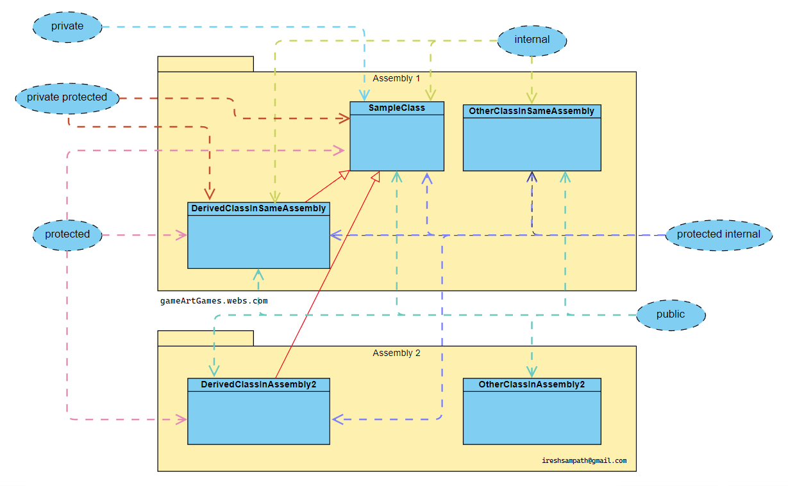

<h2>Understanding the Access Modifiers with Assemblies and Namespaces in C#</h2>

<h4>1) Class structure</h4>
<h6>The class structure of the Code and the Chart </h6>

&nbsp;-Assembly1 
&nbsp;&nbsp;&nbsp;-SampleClass 
&nbsp;&nbsp;&nbsp;&nbsp;&nbsp;-SampleClass2Nested 
&nbsp;&nbsp;&nbsp;-DerivedClassInSameAssembly 
&nbsp;&nbsp;&nbsp;-OtherClassInSameAssembly 
&nbsp;-Assembly2 
&nbsp;&nbsp;&nbsp;-DerivedClassInAssembly2 
&nbsp;&nbsp;&nbsp;-OtherClassInAssembly2 

<h4>2) Refference image</h4>
<h6>Accessibility Chart of the Access Modifiers </h6>

  

<h4>3) Refference links</h4>
	- ⚡ https://learn.microsoft.com/en-us/dotnet/csharp/programming-guide/classes-and-structs/access-modifiers 
	- ⚡ https://learn.microsoft.com/en-us/dotnet/csharp/language-reference/keywords/access-modifiers 

<h4>4) Developer's links</h4> 
  

  - ⚡ https://www.linkedin.com/in/ireshsampath/ 
  - ⚡ https://gameartgames.webs.com/ 
  - ⚡ https://www.travel360srilanka.com/ 

